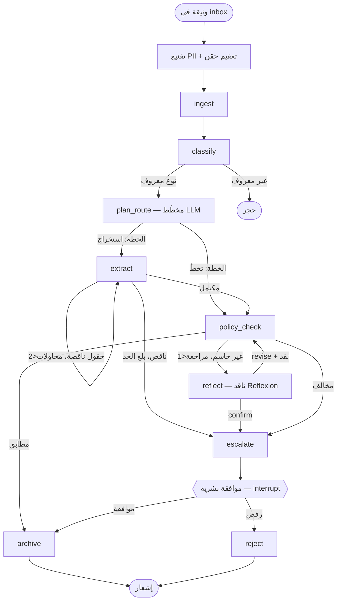

# Document Lifecycle Agent — وكيل دورة حياة الوثيقة المؤسسية

نظام ذكاء اصطناعي **توكيلي متعدد الوكلاء** يعالج الوثائق المؤسسية من الاستلام
إلى الأرشفة: يصنّفها، يستخرج بنودها، يدقّقها بسياسات الامتثال، ويصعّد المخالف
لموافقة بشرية — مع حواجز أمنية، أثر تدقيق غير قابل للعبث، ومراقبة تكلفة.

> **البرنامج التدريبي**: هندسة أنظمة الذكاء الاصطناعي التوكيلي المتقدمة —
> أكاديمية سدايا SDAIA، الدفعة 9–13 أغسطس 2026 (الرياض).
> مرجع: <https://github.com/SDAIAAcademy>

## المشكلة التي يحلها

المؤسسات تستقبل عقودًا وفواتير وخطابات تحتاج تصنيفًا وتدقيق امتثال يدويًا بطيئًا.
هذا الوكيل يؤتمت المسار **دون التخلي عن الحوكمة**: القرارات الخطرة (المخالفات)
تتوقف لموافقة بشرية، وكل خطوة مسجّلة في أثر تدقيق قابل للتحقق، والبيانات الشخصية
تُقنَّع قبل أي نداء نموذج.

## المعمارية



- **الوكلاء المتخصصون** (`src/agents/`): مصنّف classifier، مستخرِج extractor،
  مدقق سياسات policy_checker — كلٌّ يعيد **نوعًا محددًا Pydantic** (لا نص حر)
  فلا تتشوّه المعلومة بين الوكلاء.
- **أفعال حقيقية لا حالات**: `archive` يكتب الوثيقة **ويقيّد القرار** في قاعدة
  SQLite قابلة للاستعلام، و`notify` يولّد نص الإشعار بقالب Jinja2 ويكتبه ملفًا.
- **المنسق** = مخطط الحالة نفسه (`src/graph/build.py`): عقد nodes وحواف شرطية
  conditional edges.
- **نمط Plan-and-Execute**: عقدة `plan_route` تنادي **مخطِّطًا LLM** يعيد خطة
  typed (`ExecutionPlan`: هل يُتخطى الاستخراج + خطوات + مبرر)، والحافة الشرطية
  تستهلك قرار النموذج — لا شرط مكتوب في الكود.
- **نمط Reflexion**: عند حكم **غير حاسم** يدخل وكيل مراجعة ناقد
  (المقيّم+العاكس) يعيد `revise` مع نقد قابل للتنفيذ فيُعاد التدقيق مرة واحدة،
  أو `confirm` فيُصعَّد للبشر. حلقة محدودة بمحاولة واحدة.
- **حلقة الاستخراج**: إعادة بتلميح عند نقص الحقول، محدودة بمحاولتين.
- **الذاكرة/الحالة**: `SqliteSaver` checkpointer — التوقف عند الموافقة البشرية
  والاستئناف **عبر عملية منفصلة** (`langgraph interrupt` + `Command(resume=...)`).
- **مخزن السياسات**: ChromaDB بمضمِّن **محلي** (لا تُرسَل بيانات خارج الجهاز).
- **استيعاب PDF حقيقي**: عقود PDF عربية تُقرأ بـ`pypdf` وتُطبَّع (صيغ العرض
  presentation forms ← حروف عادية، أرقام عربية-هندية ← لاتينية، تواريخ مقلوبة
  ← ISO). القاعدة المتبعة من خبرة سابقة: **لا** إعادة تشكيل reshaping قبل
  النموذج — تعكس النص منطقيًا وتدمّر فهمه.

## المكوّنات

| المجلد/الملف | المسؤولية |
|---|---|
| `src/schemas.py` | عقود Pydantic + أثر تدقيق بسلسلة تجزئة hash-chain |
| `src/llm.py` | نداء OpenRouter، تدوير مفتاحين (402/403)، عداد توكنز/تكلفة، تنقيح أسرار |
| `src/graph/build.py` | مخطط الحالة: العقد والحواف الشرطية والحلقة والتصعيد |
| `src/agents/` | الوكلاء المتخصصون ومطالباتهم |
| `src/tools.py` | **أدوات حقيقية** يستدعيها الوكيل: بحث السياسات + حاسبة بمحلّل AST آمن |
| `src/agents/react.py` | حلقة ReAct: فكرة ← فعل ← ملاحظة، بذاكرة قصيرة المدى |
| `src/guardrails/` | حقن (كشف+تغليف)، PII، اجتياز مسار، ميزانية/حجم |
| `src/policy_store.py` | ChromaDB بمضمِّن محلي، يفهرس السياسات الموثوقة فقط |
| `src/observability/` | traces كملفات، عدادات Prometheus، لوحة HTML |
| `src/loaders.py` | استخراج نص من **PDF حقيقي** (pypdf) + تطبيع تشوهات العربية |
| `tools/make_sample_pdfs.py` | أداة تطوير: توليد عقود PDF عربية اصطناعية |
| `src/effects.py` | الأفعال الحقيقية: أرشفة الوثيقة + قيد القرار في SQLite + إشعار Jinja2 |
| `src/pipeline.py` | تجميع: تقنيع/حواجز قبل المخطط ثم التشغيل والأثر |
| `src/app.py` | خدمة FastAPI: `POST /process`، `POST /resume`، `GET /metrics`، `GET /healthz` |
| `main.py` | CLI: `run` / `resume` / `attack` / `resilience-demo` |

## التشغيل

### المتطلبات
- Python 3.11+ (طُوّر على 3.12)
- مفتاح OpenRouter (نماذج مجانية كافية)

### الإعداد
```bash
python -m venv .venv && . .venv/Scripts/Activate.ps1   # ويندوز
pip install -r requirements.txt
cp .env.example .env          # ثم ضع مفتاح OpenRouter في .env
```

### الأوامر
```bash
python main.py run                    # يعالج كل وثائق sample_docs/
python main.py resume <thread_id> approve   # يستأنف وثيقة متوقفة عند الموافقة
python main.py attack                  # سيناريو الاختراق (محصّن)
python main.py attack --no-guardrails  # نفس الهجوم بلا حواجز (دليل «قبل»)
```

### الخدمة (Docker)
```bash
docker build -t doc-agent . && docker run -p 8000:8000 --env-file .env doc-agent
# ثم: POST http://localhost:8000/process  {"doc_id":"d1","text":"..."}
```

### الاختبارات
```bash
pytest -v          # 81 اختبارًا (schemas, llm, graph, checkpoint, guardrails, policy)
```

## الأدلة المحفوظة (`reports/`)

- `live-run.md` — سجل تشغيل حي فعلي على OpenRouter + استئناف عبر عملية + مخرج pytest.
- `pentest-report.md` — اختبار اختراق قبل/بعد التحصين، بست فئات هجوم.
- `generated/traces/<doc_id>.json` — أثر كل وثيقة مع التحقق من سلامة السلسلة.
- `generated/metrics-snapshot.json` — توكنز/كمون/تكلفة لكل وثيقة.
- `generated/dashboard.html` — لوحة مراقبة تُفتح دون تشغيل.
- `../archive/*.txt` + `notifications/*.md` — **مخرجات أفعال حقيقية**: الوثائق
  المؤرشفة والإشعارات المولَّدة. وقاعدة `archive/decisions.sqlite` تحمل قيد كل
  قرار (قابلة للاستعلام) وتُعاد بناؤها بكل تشغيلة فلا تُتتبَّع في git.

## الأمن (ملخص)

كشف الحقن قائمة حظر لها حدود موثقة بصدق؛ الدفاع الأمتن **التغليف** + **الموافقة
البشرية**. PII (هوية/آيبان/جوال) تُقنَّع قبل أي نداء نموذج ولا تدخل الcheckpoint.
حواجز اجتياز المسار والحجم والميزانية. التفصيل في `reports/pentest-report.md`.

## ترقيات مستقبلية (خارج نطاق التسليم الحالي)

- **MinIO/S3** بدل مجلد `inbox/` لاستلام سحابي.
- **PostgresSaver** بدل SQLite لحالة موزّعة (نفس الواجهة).
- **Grafana** فوق عدادات Prometheus المصدَّرة على `/metrics`.
- **OCR** للوثائق **الممسوحة ضوئيًا** (استخراج PDF النصي منفَّذ بالفعل).

## الترخيص والإسناد

مشروع تدريبي ضمن برنامج سدايا «هندسة أنظمة الذكاء الاصطناعي التوكيلي المتقدمة»
(الدفعة 9–13 أغسطس 2026). الوثائق والسياسات كلها **اصطناعية** لأغراض التدريب.
